# Tutor Reservation API

API RESTful desarrollada con Laravel para gestionar reservas de tutorías entre estudiantes y tutores.

La aplicación permite:

* Registro e inicio de sesión.
* Gestión de usuarios y roles.
* Consulta de tutores.
* Gestión de materias.
* Gestión de disponibilidad de tutores.
* Consulta de calendarios.
* Creación de reservas.
* Pagos mediante PayPal Sandbox.
* Confirmación automática mediante Webhook de PayPal.
* Consulta de historial de pagos.
* Cancelación de reservas.
* Notificaciones por correo electrónico y WhatsApp.

---

# 1. Roles

El sistema utiliza tres roles:

| ID | Rol           |
| -: | ------------- |
|  1 | Administrator |
|  2 | Tutor         |
|  3 | Student       |

## Permisos generales

### Administrator

Puede gestionar usuarios y operaciones administrativas del sistema.

### Tutor

Puede:

* Consultar su perfil.
* Consultar su calendario.
* Configurar su disponibilidad.
* Consultar sus reservas.
* Consultar información relacionada con sus estudiantes.

No puede:

* Crear reservas para sí mismo.
* Crear pagos.
* Cancelar reservas de estudiantes.

### Student

Puede:

* Registrarse.
* Iniciar sesión.
* Consultar tutores.
* Consultar calendarios.
* Consultar disponibilidad.
* Crear órdenes de pago.
* Aprobar pagos mediante PayPal.
* Consultar sus reservas.
* Consultar sus pagos.
* Cancelar sus propias reservas confirmadas cuando cumplen la regla de anticipación.

---

# 2. Arquitectura general

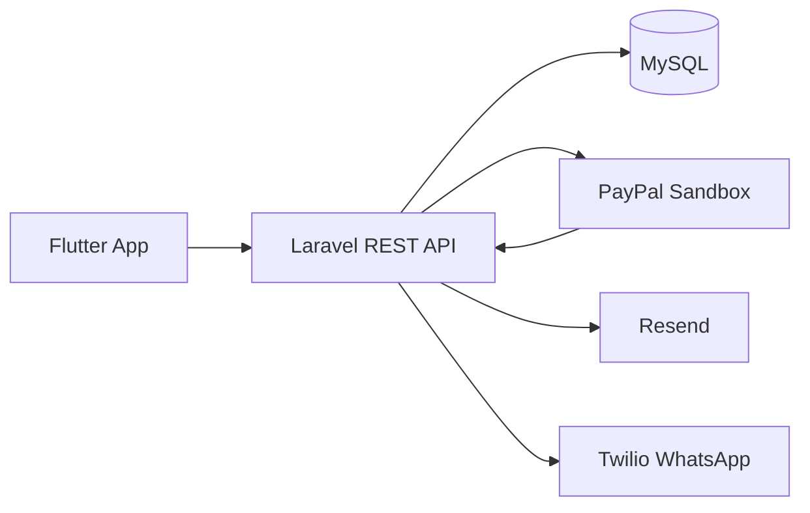

Flutter consume la API REST de Laravel.

Laravel es responsable de:

* Autenticación.
* Reglas de negocio.
* Reservas.
* Disponibilidad.
* Pagos.
* Webhooks.
* Persistencia.
* Notificaciones.

---

# 3. Autenticación

La autenticación utiliza Laravel Sanctum.

Los usuarios autenticados reciben un token que permite acceder a las funcionalidades protegidas de la API.

El webhook de PayPal es una excepción porque es ejecutado directamente por PayPal y no por un usuario autenticado.

---

# 4. Base de datos

El sistema utiliza principalmente las siguientes tablas:

* `roles`
* `users`
* `tutor_calendars`
* `tutor_availabilities`
* `reservations`
* `reservation_details`
* `paypal_orders`
* `personal_access_tokens`

## Diagrama entidad-relación

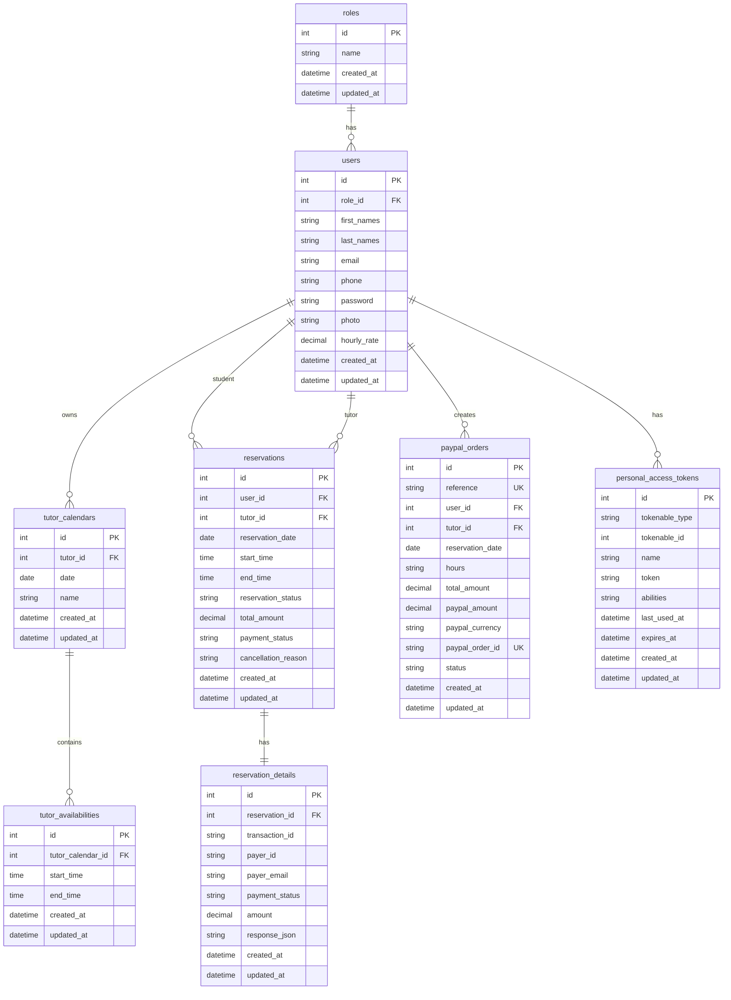

> `paypal_orders.tutor_id` también referencia a `users.id`, pero se mantiene como campo FK en la tabla para identificar al tutor de la orden. No se agrega una relación visual adicional para evitar duplicar la relación `users -> paypal_orders` en el diagrama.

---

# 5. Tabla `roles`

Almacena los roles disponibles en el sistema.

```text
1 = administrator
2 = tutor
3 = student
```

La relación principal es:

```text
roles 1 ---- N users
```

Un rol puede pertenecer a muchos usuarios.

---

# 6. Tabla `users`

Contiene estudiantes, tutores y administradores.

Un campo importante agregado para los tutores es:

```text
hourly_rate
```

Este campo representa el valor de una hora de tutoría en **USD**.

Ejemplo:

```text
hourly_rate = 20
```

Significa:

```text
1 hora = 20 USD
```

El valor no es global.

Cada tutor puede tener una tarifa diferente.

---

# 7. Tabla `tutor_calendars`

Representa el calendario configurado por un tutor para una fecha determinada.

Ejemplo:

```text
Tutor: Carlos Perez
Fecha: 2026-09-20
Nombre: Horario de clases de septiembre
```

La tabla permite asociar un calendario con un tutor.

---

# 8. Tabla `tutor_availabilities`

Contiene las horas disponibles dentro de un calendario.

Por ejemplo:

```text
08:00 - 09:00
09:00 - 10:00
10:00 - 11:00
14:00 - 15:00
```

La relación es:

```text
tutor_calendars
       |
       | 1:N
       v
tutor_availabilities
```

---

# 9. Tabla `reservations`

Representa una reserva confirmada después de completar correctamente el pago.

Contiene:

* Estudiante.
* Tutor.
* Fecha.
* Hora inicial.
* Hora final.
* Estado de reserva.
* Estado de pago.
* Valor total.
* Razón de cancelación.

Estados utilizados:

```text
reservation_status:
confirmed
cancelled
```

Estado de pago:

```text
payment_status:
completed
```

La reserva se crea después de que PayPal confirma correctamente el pago.

---

# 10. Tabla `reservation_details`

Contiene la información relacionada con la transacción del pago.

Guarda datos como:

```text
transaction_id
payer_id
payer_email
payment_status
amount
response_json
```

`response_json` conserva información técnica de la respuesta de PayPal.

Esta información es interna y no se expone directamente al estudiante en el historial normal de pagos.

---

# 11. Tabla `paypal_orders`

Esta tabla controla la orden de PayPal antes y durante el proceso de pago.

Su función es conservar la información necesaria para relacionar:

```text
Student
   |
   v
PayPal Order
   |
   v
Payment
```

La reserva se crea posteriormente cuando PayPal confirma que el pago fue completado.

## Campos importantes

### `reference`

Identificador interno de la aplicación.

Ejemplo:

```text
c7e487a3-288a-49e7-b61e-be956d26f72b
```

No es el ID generado por PayPal.

---

### `user_id`

Identifica al estudiante que inició el pago.

---

### `tutor_id`

Identifica al tutor asociado a la reserva que se está intentando realizar.

---

### `reservation_date`

Fecha solicitada para la tutoría.

---

### `hours`

Guarda las horas seleccionadas por el estudiante.

Ejemplo:

```json
[
    "09:00",
    "10:00"
]
```

Esto permite conservar exactamente las horas seleccionadas antes de crear la reserva.

---

### `total_amount`

Valor calculado por la aplicación.

Ejemplo:

```text
40.00 USD
```

Si el tutor cobra:

```text
20 USD/hora
```

y se seleccionan dos horas:

```text
09:00
10:00
```

el cálculo es:

```text
20 × 2 = 40 USD
```

---

### `paypal_amount`

Monto enviado a PayPal.

Actualmente la aplicación trabaja directamente en USD, por lo que normalmente:

```text
total_amount = paypal_amount
```

---

### `paypal_currency`

Moneda utilizada para el pago.

Actualmente:

```text
USD
```

---

### `paypal_order_id`

ID de la orden generada por PayPal.

Ejemplo:

```text
6NB033033M9945610
```

Este campo puede permanecer vacío antes de que PayPal genere correctamente la orden.

---

### `status`

Estado de la orden local.

Los estados utilizados por la aplicación incluyen:

```text
pending
completed
cancelled
expired
```

---

# 12. Flujo de reserva y pago

La reserva y el pago son procesos relacionados, pero no son exactamente la misma operación.

La creación de una orden de PayPal **no significa que la reserva ya esté confirmada**.

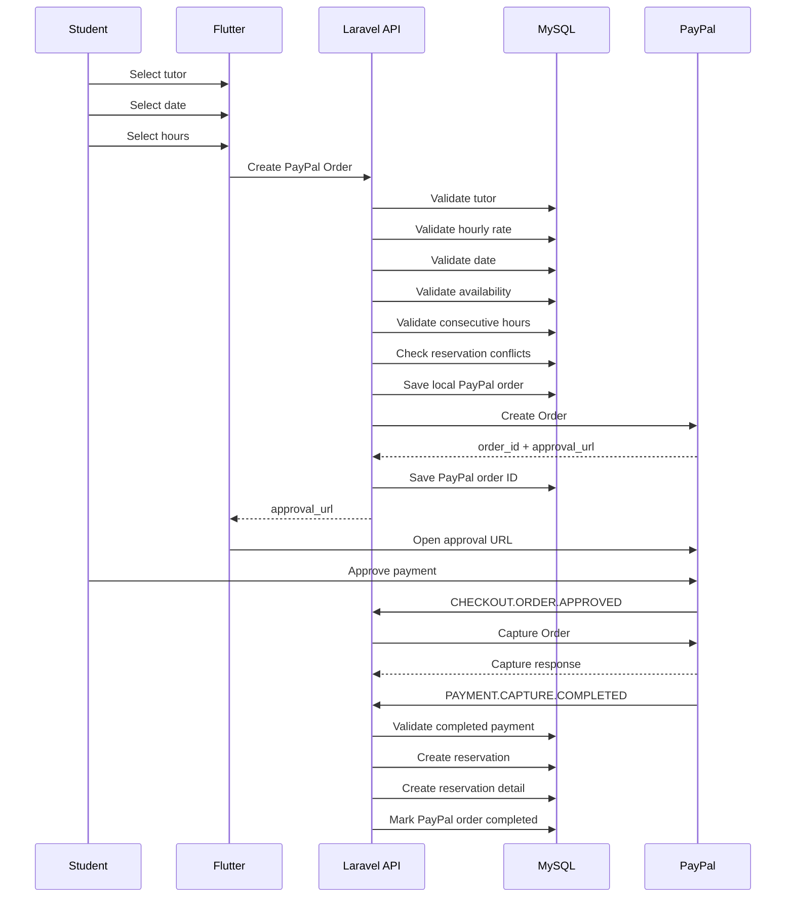

---

# 13. Pago con PayPal

El pago funciona mediante PayPal Sandbox.

El flujo general es:

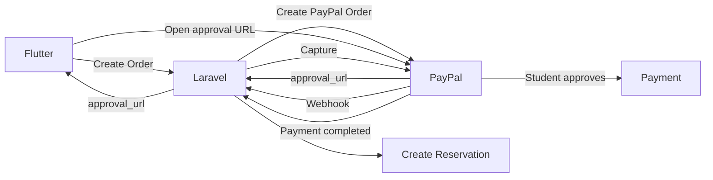

Flutter únicamente participa en la creación de la orden y en la apertura de la URL de aprobación.

---

# 14. Responsabilidad de Flutter

Flutter:

1. Envía la solicitud para crear la orden.
2. Recibe `approval_url`.
3. Abre la página de PayPal.
4. El estudiante aprueba el pago.
5. Espera que el backend confirme la reserva.

Flutter **no ejecuta el webhook**.

La comunicación del webhook es:

```text
PayPal → Laravel
```

---

# 15. Webhook de PayPal

PayPal llama directamente al backend mediante el webhook.

```text
PayPal
   |
   | Webhook
   v
Laravel
```

El webhook no utiliza Sanctum porque no es una petición realizada por un usuario de la aplicación.

El endpoint debe ser público para que PayPal pueda acceder a él.

---

# 16. Eventos del Webhook

Los eventos principales utilizados son:

```text
CHECKOUT.ORDER.APPROVED
PAYMENT.CAPTURE.COMPLETED
```

## `CHECKOUT.ORDER.APPROVED`

Indica que el estudiante aprobó la orden.

Laravel obtiene el ID de la orden de PayPal y realiza el proceso de captura.

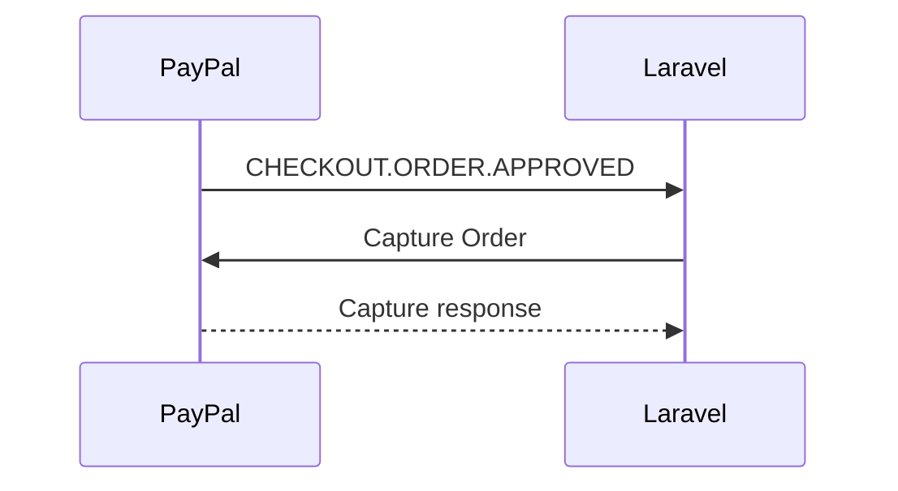

---

# 17. `PAYMENT.CAPTURE.COMPLETED`

Cuando el pago queda completado, PayPal envía:

```text
PAYMENT.CAPTURE.COMPLETED
```

Laravel verifica:

* Que exista la referencia local.
* Que el estado sea `COMPLETED`.
* Que exista la orden local.
* Que el monto coincida.
* Que la moneda coincida.

Después de estas validaciones se crea la reserva.

---

# 18. Confirmación de la reserva

La reserva no se confirma cuando se crea la orden de PayPal.

Inicialmente:

```text
paypal_orders.status = pending
```

Después de:

```text
PAYMENT.CAPTURE.COMPLETED
```

Laravel realiza:

```text
Create Reservation
Create ReservationDetail
Update PaypalOrder
```

Finalmente:

```text
paypal_orders.status = completed

reservation.payment_status = completed

reservation.reservation_status = confirmed
```

---

# 19. Flujo de estados del pago

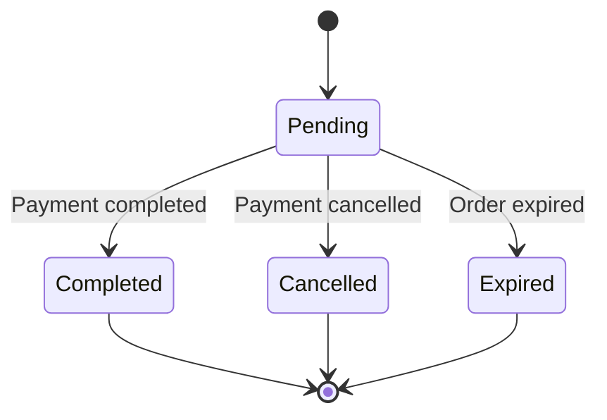

---

# 20. Flujo de estados de una reserva

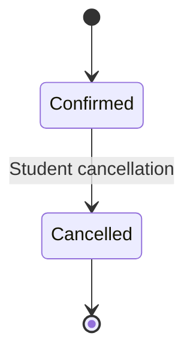

La reserva se crea como `confirmed` después de que el pago ha sido completado correctamente.

---

# 21. Idempotencia del Webhook

El webhook puede ser recibido más de una vez.

Por eso Laravel verifica si la orden ya fue procesada.

Si:

```text
paypal_orders.status = completed
```

la reserva no se vuelve a crear.

Esto evita reservas duplicadas.

---

# 22. Validación del monto

Laravel valida el monto recibido de PayPal antes de confirmar la reserva.

Se compara:

```text
Monto esperado por la aplicación
```

contra:

```text
Monto recibido de PayPal
```

También se valida la moneda:

```text
USD
```

Si el monto o la moneda no coinciden, el pago no debe procesarse como válido.

---

# 23. Historial de pagos

El historial de pagos muestra únicamente información necesaria para el estudiante.

Ejemplo:

```json
{
    "id": 5,
    "reservation_id": 9,
    "transaction_id": "4YA39805A699244C",
    "payment_status": "completed",
    "amount": "20.00",
    "currency": "USD",
    "reservation": {
        "id": 9,
        "date": "2026-09-23",
        "start_time": "10:00",
        "end_time": "11:00",
        "tutor": {
            "id": 33,
            "name": "Carlos Perez"
        }
    }
}
```

La información técnica completa de PayPal, como `response_json`, no se expone en esta respuesta.

---

# 24. Disponibilidad

Los tutores trabajan con bloques de una hora.

El sistema genera slots entre:

```text
08:00
09:00
10:00
11:00
12:00
13:00
14:00
15:00
16:00
17:00
```

Cada bloque representa una hora.

Ejemplo:

```text
09:00 - 10:00
```

---

# 25. Horas consecutivas

Cuando un estudiante selecciona varias horas para una sola reserva, deben ser consecutivas.

Permitido:

```text
09:00
10:00
11:00
```

No permitido:

```text
09:00
11:00
```

porque existe un espacio entre las horas.

---

# 26. Reservas y disponibilidad

Una hora ocupada por una reserva confirmada no puede ser seleccionada nuevamente.

Las reservas existentes se consideran al generar el calendario.

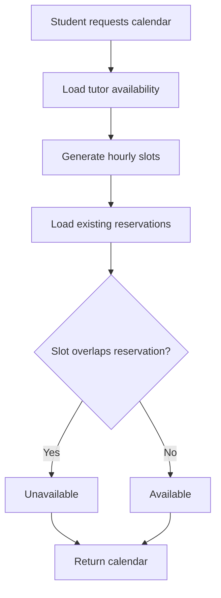

---

# 27. Cancelación de reservas

Solo el estudiante propietario de la reserva puede cancelarla.

Condiciones:

* El usuario debe ser estudiante.
* La reserva debe existir.
* La reserva debe pertenecer al estudiante.
* La reserva debe estar `confirmed`.
* No puede ser una reserva pasada.
* Deben existir al menos 24 horas de anticipación.

Cuando se cancela:

```text
reservation_status = cancelled
```

También se guarda:

```text
cancellation_reason
```

---

# 28. Flujo de cancelación

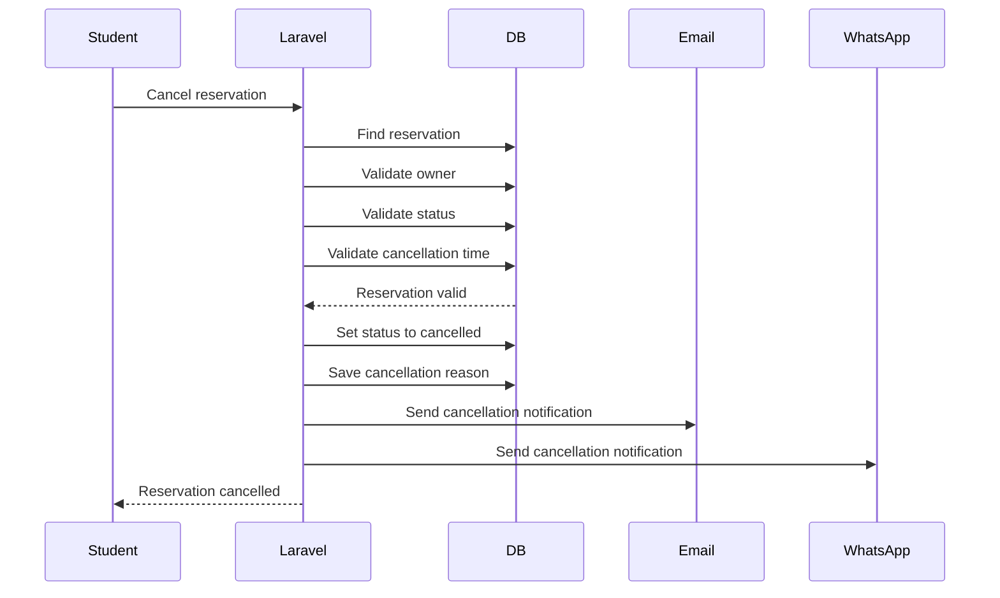

Los errores de notificación no deben revertir la cancelación de la reserva.

---

# 29. Filtros de reservas

Las reservas pueden consultarse utilizando filtros por fecha y estado.

Estados permitidos:

```text
confirmed
cancelled
```

Si no se proporciona un estado, se pueden consultar las reservas sin filtrar por estado.

También es posible combinar fecha y estado.

Ejemplo conceptual:

```text
date + status
```

Un estado diferente de los permitidos debe ser rechazado por validación.

---

# 30. Notificaciones

Después de completar un pago se envían:

* Email de confirmación.
* WhatsApp de confirmación.

Después de cancelar una reserva se envían:

* Email de cancelación.
* WhatsApp de cancelación.

Las notificaciones son secundarias.

Si Resend o Twilio fallan, el pago o la reserva no deben fallar por ese motivo.

---

# 31. Normalización de teléfono

Para WhatsApp se normaliza el teléfono.

Si el número no contiene `+`, se agrega:

```text
+57
```

Ejemplo:

```text
3001234567
```

se convierte en:

```text
+573001234567
```

---

# 32. Organización del proyecto

La lógica principal se encuentra separada en:

```text
app/
├── Controllers/
│   └── API/
├── Models/
├── Services/
├── Requests/
├── Exceptions/
└── ...
```

Los servicios principales incluyen:

```text
PaymentService
ReservationService
TutorCalendarService
NotificationService
```

Para PayPal se contempla separar responsabilidades en:

```text
Services/
├── PaymentService.php
├── Paypal/
│   ├── PaypalClient.php
│   ├── PaypalOrderService.php
│   └── PaypalCaptureService.php
├── Reservations/
│   ├── ReservationCreationService.php
│   └── ReservationAvailabilityService.php
└── Payments/
    └── PaymentHistoryService.php
```

La finalidad es evitar que `PaymentService` concentre demasiadas responsabilidades.

---

# 33. Separación de responsabilidades de pagos

## PaymentService

Orquesta el proceso general de pago.

Responsabilidades principales:

```text
createOrder()
handlePaymentCompleted()
```

## PaypalClient

Se encarga de crear y configurar el cliente del SDK de PayPal.

## PaypalOrderService

Responsable de:

* Crear PayPal Orders.
* Obtener `order_id`.
* Obtener `approval_url`.

## PaypalCaptureService

Responsable de:

* Capturar órdenes.
* Validar información de captura.
* Validar monto.
* Validar moneda.

## ReservationAvailabilityService

Responsable de:

* Normalizar horas.
* Validar horas consecutivas.
* Validar disponibilidad.
* Detectar conflictos.

## ReservationCreationService

Responsable de:

* Crear `reservations`.
* Crear `reservation_details`.
* Actualizar `paypal_orders`.

## PaymentHistoryService

Responsable de:

* Consultar pagos.
* Transformar la información para la API.
* Ocultar información interna de PayPal.

---

# 34. Seguridad de PayPal

El webhook debe ser público porque PayPal necesita acceder directamente al backend.

Durante las pruebas locales se utiliza una URL pública mediante ngrok.

En producción debe implementarse la validación de la firma del webhook de PayPal.

El flujo de comunicación es:

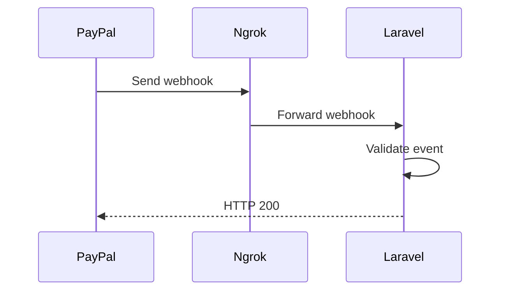

---

# 35. Flujo completo de arquitectura del pago

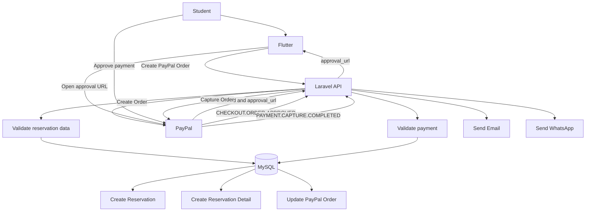

---

# 36. Estados finales después de un pago exitoso

Después de un pago correcto:

```text
paypal_orders
    status = completed
```

```text
reservations
    payment_status = completed
    reservation_status = confirmed
```

```text
reservation_details
    payment_status = completed
```

El monto de la reserva se conserva en:

```text
reservations.total_amount
```

El monto registrado en el detalle del pago se conserva en:

```text
reservation_details.amount
```

---

# 37. Moneda

La aplicación trabaja directamente en:

```text
USD
```

No existe conversión COP → USD dentro del flujo actual.

Por lo tanto:

```text
hourly_rate
```

representa USD por hora.

Ejemplo:

```text
hourly_rate = 20
```

significa:

```text
20 USD / hora
```

---

# 38. Responsabilidades por rol

| Funcionalidad             | Administrator |   Tutor | Student |
| ------------------------- | ------------: | ------: | ------: |
| Autenticarse              |            Sí |      Sí |      Sí |
| Gestionar usuarios        |            Sí |      No |      No |
| Consultar tutores         |            Sí |      Sí |      Sí |
| Consultar calendarios     |            Sí |      Sí |      Sí |
| Configurar disponibilidad |            No |      Sí |      No |
| Consultar reservas        |            Sí |      Sí |      Sí |
| Crear orden de pago       |            No |      No |      Sí |
| Aprobar pago PayPal       |            No |      No |      Sí |
| Procesar webhook          |       Backend | Backend | Backend |
| Consultar pagos propios   |            Sí |      No |      Sí |
| Cancelar reserva propia   |            No |      No |      Sí |
| Recibir notificaciones    |            Sí |      Sí |      Sí |

---

# 39. Resumen conceptual

El flujo principal de la aplicación es:

```mermaid
flowchart LR

    A[Student] --> B[Select Tutor]
    B --> C[Select Date]
    C --> D[Select Available Hours]
    D --> E[Create PayPal Order]
    E --> F[Approve Payment]
    F --> G[PayPal Webhook]
    G --> H[Capture Payment]
    H --> I[Create Reservation]
    I --> J[Create Payment Detail]
    J --> K[Send Notifications]
```

La regla principal del sistema es:

```text
Crear PayPal Order
        !=
Crear Reservation
```

La reserva solamente se confirma después de recibir y procesar correctamente:

```text
PAYMENT.CAPTURE.COMPLETED
```

Por lo tanto:

```text
Flutter
   |
   | Crear orden
   v
Laravel
   |
   | Crear PayPal Order
   v
PayPal
   |
   | approval_url
   v
Flutter
   |
   | Estudiante aprueba
   v
PayPal
   |
   | Webhook
   v
Laravel
   |
   | Confirmar pago
   v
Reservation
```

PayPal confirma el pago y Laravel confirma la reserva.
